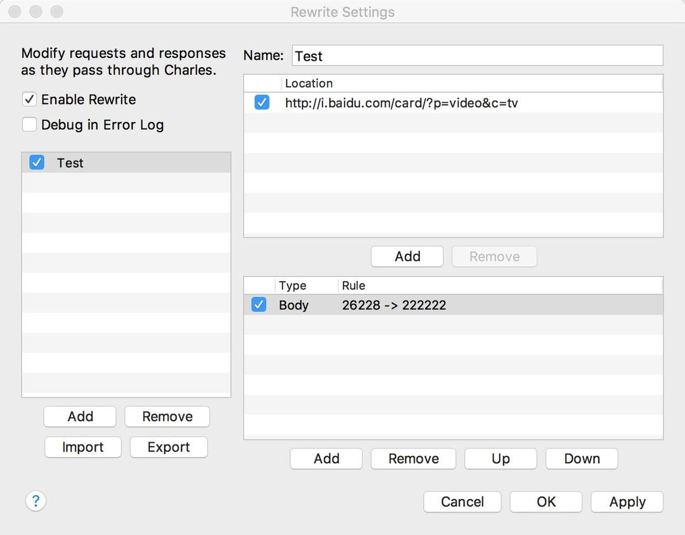

### 简介

Charles是常用的截取网络封包的工具(俗称抓包)。Charles 通过将自己设置成系统的网络访问代理服务器，使得所有的网络访问请求都通过它来完成，从而实现了网络封包的截取和分析。 
Charles 是收费软件，可以免费试用30 天。试用期过后，未付费的用户仍然可以继续使用，但是每次使用时间不能超过30 分钟，并且启动时将会有10 秒钟的延时。

### 安装

首先从[Charles官网](https://www.charlesproxy.com/)下载安装包进行安装。 

### 使用介绍

Charles 主要提供两种查看封包的视图，分别名为 “Structure” 和 “Sequence”。 

- Structure 视图将网络请求按访问的域名分类。 
- Sequence 视图将网络请求按访问的时间排序。 

可以根据具体的需要在这两种视图之前来回切换。请求多了有些时候会看不过来，Charles 提供了一个简单的 Filter 功能，可以输入关键字来快速筛选出 URL 中带指定关键字的网络请求。 

对于某一个具体的网络请求，你可以查看其详细的请求内容和响应内容。如果请求内容是 POST 的表单，Charles 会自动帮你将表单进行分项显示。如果响应内容是 JSON 格式的，那么 Charles 可以自动帮你将 JSON 内容格式化，方便你查看。如果响应内容是图片，那么 Charles 可以显示出图片的预览。

### 使用开始

- 将 Charles 设置成系统代理 

  打开charles之后，默认就已经对系统进行了代理，如果没有，则需要在菜单栏的Proxy上勾选上Mac OS X Proxy。

  

- 截取Https信息 

  截取分析 Https 协议相关的内容。那么需要安装 Charles 的 CA 证书。具体步骤如下： 
  首先需要在 Mac 电脑上安装证书。点击 Charles 的顶部菜单，选择 “Help”-> “SSL Proxying”-> “Install Charles Root Certificate”，然后输入系统的帐号密码，即可在钥匙串看到添加好的证书。默认该证书是不被信任的，在该证书上右键->”显示简介”，手动改为始终信任。 

  

- 截取移动设备中的 Https信息 
  如果我们需要在 iOS 或 Android 机器上截取 Https 协议的通讯内容，还需要在手机上安装相应的证书。点击 Charles 的顶部菜单，选择 “Help” -> “SSL Proxying” -> “Install Charles Root Certificate on a Mobile Device or Remote Browser”，然后就可以看到 Charles 弹出的简单的安装教程。 
  

  

- 过滤网络请求 
  通常情况下，我们需要对网络请求进行过滤，只监控向指定服务器上发送的请求。对于这种需求，以下几种方式： 
  1、在主界面的 Filter 栏中填入需要过滤的关键字。例如要过滤的地址是：[http://baidu.com](http://baidu.com/) , 那么只需要在 Filter 栏中填入 baidu 即可。 
  2、在 Charles 的菜单栏选择 “Proxy”->”Recording Settings”，然后选择 Include 栏，选择Add，然后填入协议，主机地址，端口号。 

  3、在想过滤的网络请求上右击，选择 “Focus”，之后在 Filter 一栏勾选上 Focussed 一项。 

  

  通常情况下，使用方法一做一些临时性的封包过滤，使用方法二做一些经常性的封包过滤，方法三可以临时性的，快速地过滤出一些没有通过关键字的一类网络请求。

- 限制网速 
  模拟慢速网络或者高延迟的网络。 
  在 Charles 的菜单上，选择 “Proxy”->”Throttle Setting” 项，在弹出的对话框中，勾选上 “Enable Throttling”，only for selected host可以设置一个指定的主机访问进行限制网络。 

  

- Map 功能 
  Charles 的 Map 功能分 Map Remote 和 Map Local 两种，Map Remote 是将指定的网络请求重定向到另一个网址请求地址，Map Local 是将指定的网络请求重定向到本地文件。 
  对于 Map Remote 功能，我们需要分别填写网络重定向的源地址和目的地址，对于不需要限制的条件，可以不填。 

  

  对于 Map Local 功能，我们需要填写的重定向的源地址和本地的目标文件。对于有一些复杂的网络请求结果，我们可以先使用 Charles 提供的 “Save Response…” 功能，将请求结果保存到本地（如下图所示），然后稍加修改，成为我们的目标映射文件。 

  

  将一个指定的网络请求通过 Map Local 功能映射到了本地的一个经过修改的文件中。 

  

  Map Local 在使用的时候，有一个潜在的问题，就是其返回的 Http Response Header 与正常的请求并不一样。这个时候如果客户端校验了 Http Response Header 中的部分内容，就会使得该功能失效。解决办法是同时使用 Map Local 以下面提到的 Rewrite 功能，将相关的 Http 头 Rewrite 成我们希望的内容。

- Rewrite 功能 

  Rewrite 功能功能适合对某一类网络请求进行一些正则替换，以达到修改结果的目的。 
  response中有个字段”id”:”26228”,我们将它修改为222222。

  

  

  一个完整的rewrite如下图： 

  

  就可以将”id”改为222222了。 

  

- DNS Spoofing 

  将目标主机把域名转换成指定域名/IP

  

- Https乱码 

  在 Charles 的工具栏上点击设置按钮，选择 SSL Proxy Settings，选中 Enable SSL Proxying，选择Add，添加要抓取的网址或者直接添加通配符*。 

  

  接下来就可以开始抓包了。

  ### 在移动设备上抓包

  在移动设备上抓包需要移动设备和电脑在同一局域网内，并且需要电脑的ip。 
  查看mac IP可以通过以下方式： 
  1、网络偏好设置中查看 
  2、打开终端输入ifconfig（Windows是ipconfig） 
  3、Charles 的顶部菜单的 “Help”->”Local IP Address”，即可在弹出的对话框中看到 IP 地址 

- iPhone 

  在”设置”->”Wi-Fi”中，可以看到当前连接的 wifi 名，通过点击右边的详情键，可以看到当前连接上的 wifi 的详细信息。 

  

  在最底部有「HTTP 代理」一项，将其切换成手动，然后填上 电脑的 IP，以及端口号 8888。

  

- Android 
  “设置”->”WLAN”，选择与电脑相同的WiFi，勾选”显示高级选项”，并将代理设置为手动。 

  

  

  然后填上 电脑的 IP，以及端口号 8888。

  

  设置好之后，我们打开 手机上的任意需要网络通讯的程序，就可以看到 Charles 弹出请求连接的确认菜单，点击 Allow 即可完成设置。接下来就可以开始抓包了。

